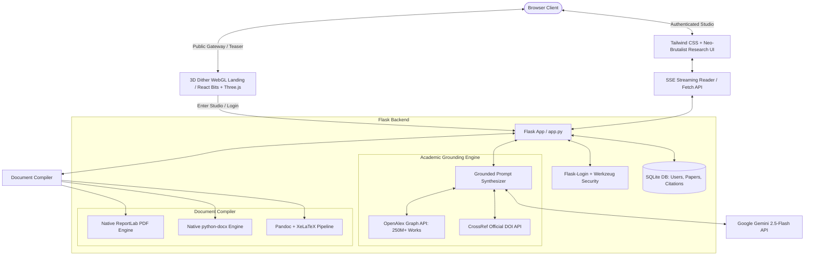

# 🎓 ScholarForge — Autonomous Academic Research Studio

[](https://www.python.org/)
[](https://flask.palletsprojects.com/)
[](https://aistudio.google.com/)
[](https://openalex.org/)
[](https://pandoc.org/)
[](https://katex.org/)
[](https://tailwindcss.com/)
[](templates/landing.html)
[](LICENSE)

**ScholarForge AI** is an advanced full-stack academic research workstation and autonomous manuscript studio. Engineered to eliminate citation hallucinations and streamline scientific writing, ScholarForge connects directly to scholarly knowledge graphs (**OpenAlex** and **CrossRef**) to ground AI synthesis in 250M+ peer-reviewed papers. It features real-time Server-Sent Events (SSE) streaming, native document compilation (PDF, DOCX, LaTeX, Markdown, TXT), an automated multi-style citation engine, and personal research library persistence.

---

## 🌟 Key Capabilities

- **⚡ Real-Time SSE Manuscript Streaming**
  - Generates publication-grade academic manuscripts with token-by-token live streaming.
  - Automatically incorporates standard IMRaD sections: *Title, Abstract, Index Keywords, Introduction, Literature Review, Methodology, Results with LaTeX Math ($E=mc^2$), Discussion, Limitations, and References*.
  - Live words counter, estimated reading time, and instant Markdown/KaTeX preview.

- **🌌 Interactive 3D Dither Retro-Wave Teaser & Gateway**
  - High-impact public landing experience powered by the custom **React Bits `<Dither />`** WebGL shader running on **Three.js** and **Postprocessing**.
  - Dynamic runtime colorway customization with 4 bespoke frontier palettes (*Cyan Deep Space, Amber Terminal, Emerald Matrix, Monochrome Cyber*).
  - Frictionless portal bridging visitors directly into authenticated research workspaces (`/login` & `/app`).

- **🔍 Verified Literature Scout (OpenAlex & CrossRef)**
  - Real-time search across 250M+ peer-reviewed scientific records.
  - Returns verified DOIs, author rosters, publication years, citation counts, and direct Open Access PDF links.
  - **One-Click Grounding**: Attach discovered papers directly to your manuscript prompt to enforce real, verified citations throughout your paper.

- **🖨️ Zero-Failure Multi-Format Document Compilation**
  - Native **PDF** export engineered with ReportLab (custom academic typography, running headers, and page counters).
  - Native Microsoft **DOCX** generation via `python-docx`.
  - Academic **LaTeX** source (`.tex`) with standard geometry, microtype, and amsmath packages.
  - Raw **Markdown** (`.md`) and Plain Text (`.txt`).
  - Seamless fallback support for Pandoc and XeLaTeX if installed on the host.

- **📑 Smart Citation & BibTeX Studio**
  - Converts raw inputs, links, or DOIs into publication-compliant citations formatted in **APA 7th**, **MLA 9th**, **Chicago 17th**, **IEEE**, or **BibTeX**.
  - One-click copy and automated archiving to your user library.

- **📂 Persistent User Research Library**
  - Relational SQLite/SQLAlchemy schema storing all generated manuscripts and citations per user.
  - Load previous drafts back into the active studio canvas, export them in different formats, or delete old records.

- **💬 Embedded AI Research Copilot**
  - Floating conversational assistant to brainstorm hypotheses, refine methodological frameworks, and review abstracts.

---

## 🏗️ System Architecture



---

## 📁 Project Directory Structure

```
ScholarForge-AI/
├── .env.example            # Environment template (Gemini API key, secret keys)
├── .gitignore              # Ignores .env, SQLite databases, temp files, and node_modules
├── academic_engine.py      # OpenAlex & CrossRef scholarly retrieval & prompt grounding
├── document_compiler.py    # Multi-format document exporter (PDF, DOCX, LaTeX, MD, TXT)
├── app.py                  # Main Flask server, SSE streaming, authentication, and REST APIs
├── check_models.py         # Diagnostic utility to verify Gemini API key and active models
├── LICENSE                 # MIT Open-Source License
├── Procfile                # Gunicorn cloud deployment configuration (Render/Heroku/Railway)
├── requirements.txt        # Production Python dependencies
├── landing/                # React 19 + Three.js + Vite source for the 3D Dither hype landing page
├── static/
│   ├── script.js           # Client-side SSE stream reader, library sync, tabs, and KaTeX
│   └── landing/            # Production WebGL shader assets (compiled JS/CSS bundles)
├── templates/
│   ├── base.html           # Layout with KaTeX, FontAwesome, and dark/light mode tokens
│   ├── landing.html        # Interactive 3D Dither shader portal entrance
│   ├── index.html          # Main academic studio (Manuscript Studio, Literature Scout, Library)
│   ├── login.html          # User authentication view
│   └── register.html       # New account onboarding view
└── temp_files/
    └── .gitkeep            # Ephemeral compilation storage
```

---

## 🚀 Quickstart Guide

### 1. Clone & Navigate
```bash
git clone https://github.com/Lohith-RC/ScholarForge-AI.git
cd ScholarForge-AI
```

### 2. Activate Virtual Environment
```bash
# Windows
python -m venv .venv
.venv\Scripts\activate

# Linux / macOS
python3 -m venv .venv
source .venv/bin/activate
```

### 3. Install Dependencies
```bash
pip install -r requirements.txt
```

### 4. Configure Environment
Copy `.env.example` to `.env`:
```bash
cp .env.example .env
```
Provide your Google Gemini API key:
```ini
GEMINI_API_KEY=your_actual_gemini_api_key_here
SECRET_KEY=your_random_secret_key_here
PORT=5000
```
> 💡 *Acquire a free API key at [Google AI Studio](https://aistudio.google.com/).*

### 5. Launch the Application
```bash
python app.py
```
Visit [http://127.0.0.1:5000](http://127.0.0.1:5000) in your browser.

---

## 🌐 API Reference

| Endpoint | Method | Auth | Description |
| :--- | :---: | :---: | :--- |
| `/` | `GET` | No | Public 3D Dither retro-wave teaser & landing portal (auto-forwards if logged in) |
| `/teaser` | `GET` | No | Dedicated standalone route for the interactive shader showcase |
| `/app` | `GET` | Yes | Main academic workstation & manuscript studio |
| `/register` | `GET`, `POST` | No | Creates a user account with hashed password |
| `/login` | `GET`, `POST` | No | Authenticates session cookie |
| `/logout` | `GET` | Yes | Terminates authenticated session |
| `/generate-stream` | `POST` | Yes | Real-time SSE streaming generation with literature grounding |
| `/generate` | `POST` | Yes | Synchronous fallback paper generation |
| `/find-papers` | `POST` | Yes | Retrieves verified scholarly papers from OpenAlex & CrossRef |
| `/generate-citation` | `POST` | Yes | Formats citation into APA, MLA, Chicago, IEEE, or BibTeX |
| `/download` | `POST` | Yes | Compiles and downloads PDF, DOCX, LaTeX, MD, or TXT |
| `/api/papers` | `GET`, `POST` | Yes | Lists or saves manuscripts in user library |
| `/api/papers/<id>` | `GET`, `DELETE` | Yes | Retrieves or removes an individual manuscript |
| `/api/citations` | `GET` | Yes | Lists user's saved citations |
| `/api/citations/<id>` | `DELETE` | Yes | Removes an individual citation |
| `/chat` | `POST` | Yes | Contextual AI research copilot conversation |

---

## ⚖️ Academic Integrity Statement

ScholarForge AI is designed as a **scaffolding and research acceleration tool**. It assists authors in discovering literature, structuring outlines, analyzing frameworks, and formatting citations. Authors retain complete responsibility for reviewing citations, fact-checking claims, and complying with academic ethics policies.

---

## 📄 License

Licensed under the [MIT License](LICENSE).
