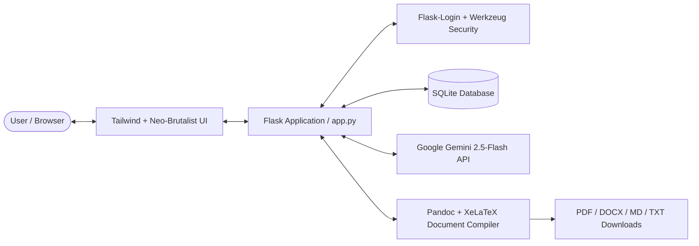

# 🎓 ScholarForge AI — Research Paper & Citation Engine

[](https://www.python.org/)
[](https://flask.palletsprojects.com/)
[](https://aistudio.google.com/)
[](https://pandoc.org/)
[](https://tailwindcss.com/)
[](LICENSE)

**ScholarForge AI** is a full-stack, AI-powered academic workspace designed to streamline the research, drafting, citation, and publication lifecycle. Built with Flask, Google Gemini, and Pandoc, ScholarForge enables researchers, university students, and technical writers to generate publication-grade research papers, format bibliographies across major citation standards (APA, MLA, Chicago, IEEE), and export documents directly to PDF, DOCX, Markdown, and TXT.

---

## 🌟 Key Features

- **📑 Intelligent Academic Paper Generation**
  - Synthesizes structured, publication-grade academic papers from any research topic or thesis prompt.
  - Automatically structures manuscripts with standard academic sections: *Title, Abstract, Keywords, Introduction, Literature Review, Methodology, Results & Discussion, Limitations, and Conclusion*.
  - Multi-language support (English, Spanish, French, etc.).

- **📚 Automated Citation Engine**
  - Formats raw source inputs (URLs, author strings, journal titles, DOIs) into clean, standard-compliant academic citations.
  - Built-in support for **APA**, **MLA**, **Chicago**, and **IEEE** styles.

- **🔍 Scholarly Bibliography Search**
  - Generates comprehensive, curated bibliographies of foundational literature and research papers relevant to any query.

- **🖨️ Multi-Format Document Compilation**
  - Converts generated Markdown manuscripts into **PDF** (via Pandoc with XeLaTeX typography), Microsoft **DOCX**, raw **Markdown**, and **TXT**.
  - Dynamic path resolution for cross-platform Pandoc execution (Windows, Linux, macOS).

- **💬 Embedded AI Research Assistant**
  - Floating contextual chatbot for literature exploration, hypothesis refinement, and interactive writing prompts.

- **🎨 Modern Neo-Brutalist "Sketch" Interface**
  - High-contrast, tactile monochrome aesthetic with smooth animations, live character counting, markdown preview toggle, and dark mode support.

- **🔒 Built-in Authentication & Session Security**
  - User registration, hashed credential storage with Werkzeug, and authenticated session management via Flask-Login.

---

## 🏗️ Architecture & Tech Stack



### Core Technologies
- **Backend Framework**: Python 3.10+, [Flask 3.x](https://flask.palletsprojects.com/)
- **Database & ORM**: SQLite, [Flask-SQLAlchemy](https://flask-sqlalchemy.palletsprojects.com/)
- **Authentication**: [Flask-Login](https://flask-login.readthedocs.io/), [Werkzeug](https://palletsprojects.com/p/werkzeug/)
- **Generative AI**: [Google Generative AI SDK](https://github.com/google-gemini/generative-ai-python) (`models/gemini-2.5-flash`)
- **Document Pipeline**: [Pandoc](https://pandoc.org/), [pypandoc](https://pypi.org/project/pypandoc/)
- **Frontend / Styling**: Vanilla JavaScript (ES6+), [Tailwind CSS](https://tailwindcss.com/), [Marked.js](https://marked.js.org/)
- **Production Server**: [Gunicorn](https://gunicorn.org/) (Linux / Cloud)

---

## 📁 Repository Structure

```
ScholarForge-AI/
├── .env.example            # Environment variables template
├── .gitignore              # Git ignore rules for virtual environments, secrets, and caches
├── app.py                  # Main Flask application and API route definitions
├── check_models.py         # Utility script to test Gemini API key and active models
├── Procfile                # Gunicorn deployment configuration for Render/Heroku
├── requirements.txt        # Python package dependencies
├── static/
│   └── script.js           # Client-side UI interactions, tabs, API requests, and chat
├── templates/
│   ├── base.html           # Base HTML layout with typography, theme switcher, and navigation
│   ├── index.html          # Main workspace dashboard (Paper Generator, Citation Engine, Chat)
│   ├── login.html          # User authentication login view
│   └── register.html       # New user onboarding view
└── temp_files/
    └── .gitkeep            # Directory for temporary document conversions
```

---

## 🚀 Quickstart Guide

### 1. Clone the Repository
```bash
git clone https://github.com/Lohith-RC/ScholarForge-AI.git
cd ScholarForge-AI
```

### 2. Set Up a Virtual Environment
```bash
# Windows
python -m venv .venv
.venv\Scripts\activate

# Linux / macOS
python3 -m venv .venv
source .venv/bin/activate
```

### 3. Install Dependencies
```bash
pip install -r requirements.txt
```

### 4. Install Pandoc (Optional for PDF/DOCX Export)
To enable document conversion to PDF and DOCX:
- **Windows**: Install via [Chocolatey](https://chocolatey.org/): `choco install pandoc miktex` or download the installer from [Pandoc Releases](https://github.com/jgm/pandoc/releases).
- **Ubuntu/Debian**:
  ```bash
  sudo apt-get update
  sudo apt-get install pandoc texlive-xetex
  ```
- **macOS**:
  ```bash
  brew install pandoc basictex
  ```

### 5. Configure Environment Variables
Copy `.env.example` to `.env`:
```bash
cp .env.example .env
```
Open `.env` and configure your credentials:
```ini
GEMINI_API_KEY=your_actual_gemini_api_key
SECRET_KEY=your_secure_random_key
```
> 💡 *To get a free Gemini API key, visit [Google AI Studio](https://aistudio.google.com/).*

### 6. Verify Model Access (Optional)
Run the diagnostic script to verify your API connection:
```bash
python check_models.py
```

### 7. Run the Application
```bash
python app.py
```
Open [http://127.0.0.1:5000](http://127.0.0.1:5000) in your web browser.

---

## 🌐 API Endpoints Reference

| Endpoint | Method | Auth Required | Description |
| :--- | :---: | :---: | :--- |
| `/register` | `GET`, `POST` | No | Register a new user account |
| `/login` | `GET`, `POST` | No | Authenticate user and initiate session |
| `/logout` | `GET` | Yes | Terminate current user session |
| `/` | `GET` | Yes | Render the main research workstation interface |
| `/generate` | `POST` | Yes | Generate structured research paper via Gemini 2.5-Flash |
| `/download` | `POST` | Yes | Convert and compile Markdown to PDF, DOCX, TXT, or MD |
| `/find-papers` | `POST` | Yes | Retrieve a formatted bibliography of related literature |
| `/generate-citation` | `POST` | Yes | Format an individual citation in APA, MLA, Chicago, or IEEE |
| `/chat` | `POST` | Yes | Contextual academic conversation with the AI assistant |

---

## ☁️ Deployment

The repository includes a `Procfile` ready for zero-configuration deployment on platforms like **Render**, **Railway**, or **Heroku**:

```
web: gunicorn app:app
```

Ensure the following environment variables are set in your cloud provider's dashboard:
- `GEMINI_API_KEY`: Your Google AI Studio API key.
- `SECRET_KEY`: A cryptographically secure random string.
- `PYTHON_VERSION`: `3.10` or higher.

---

## ⚖️ Academic Integrity & Disclaimer

> **Important**: ScholarForge AI is designed as a **scaffolding and research acceleration tool**. It is intended to assist in brainstorming, organizing outlines, understanding methodologies, and formatting reference material. 
> 
> Users are strictly responsible for verifying citations, fact-checking assertions against primary literature, and adhering to their academic institution's policies regarding generative AI.

---

## 📄 License

This project is licensed under the [MIT License](LICENSE) — feel free to use, modify, and build upon it.
